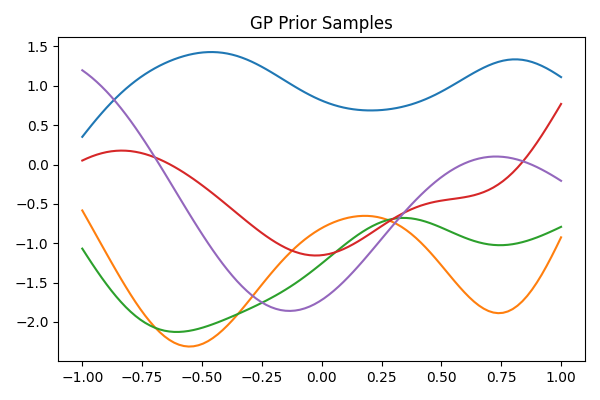
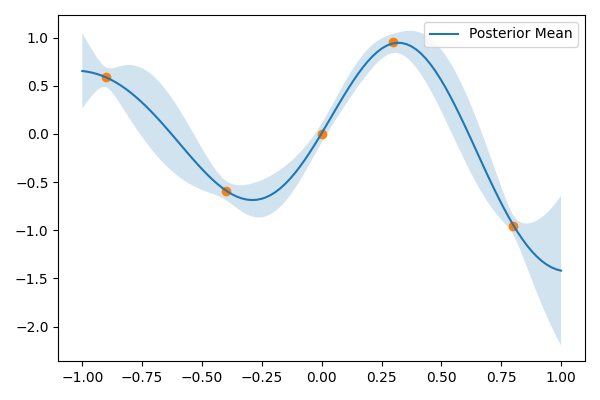

# Gaussian Process

Minimal Gaussian Process regression implementation, as introduced in *Pattern Recognition and Machine Learning* by \
Christopher M. Bishop, section 6.4.

## Run

`python build.py`

## Figures

### Prior

### Posterior

## Theoretical minimum

- **Prior:** \( f(x)\sim\mathcal{GP}(0,k(x,x')) \)
- **Kernel (RBF):** \( k(x,x')=\exp\!\left(-\frac{(x-x')^2}{2\ell^2}\right) \)
- **Noisy observations:** \( y=f(x)+\epsilon,\ \epsilon\sim\mathcal{N}(0,\sigma_n^2) \)
- **Posterior mean:** \( \mu_* = K_*^\top (K+\sigma_n^2I)^{-1}y \)
- **Posterior covariance:** \( \Sigma_* = K_{**}-K_*^\top (K+\sigma_n^2I)^{-1}K_* \)

Interpretation: mean = prediction, \(\pm2\sigma\) band = uncertainty.
